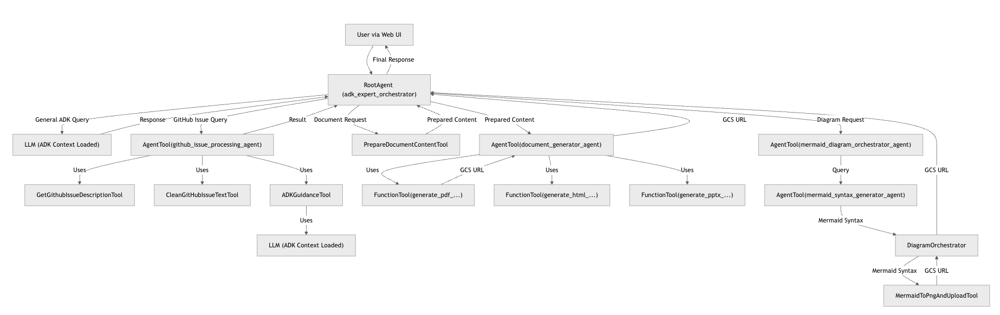
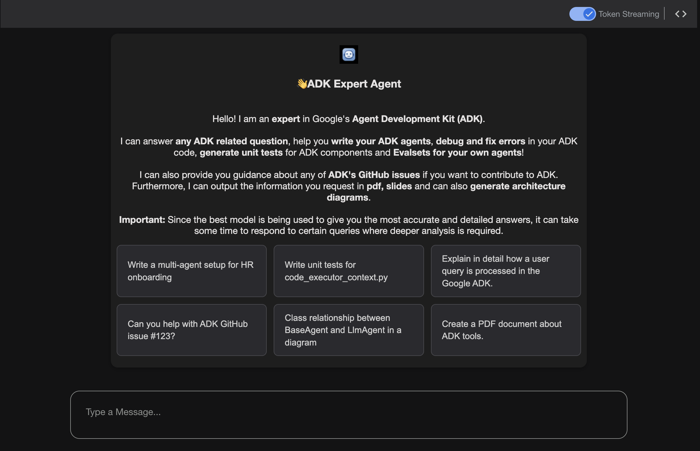
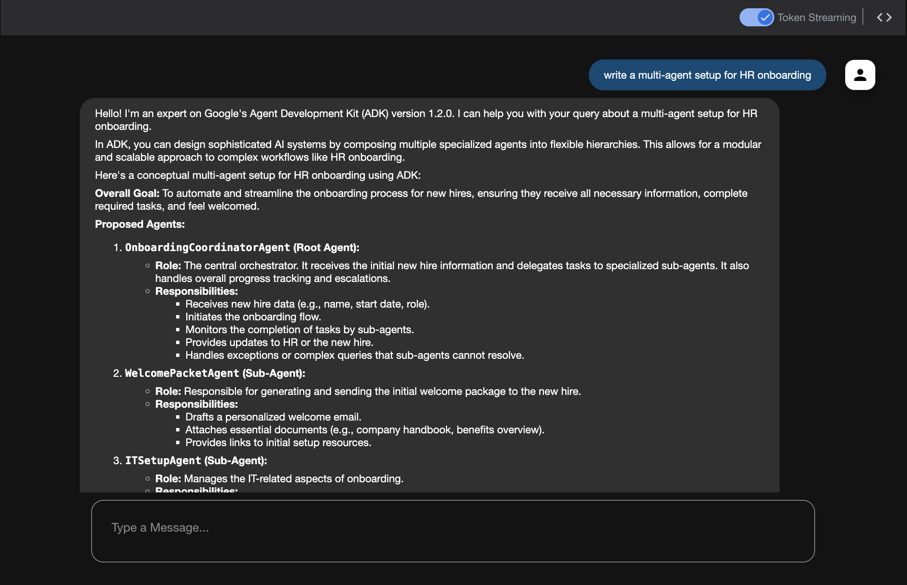
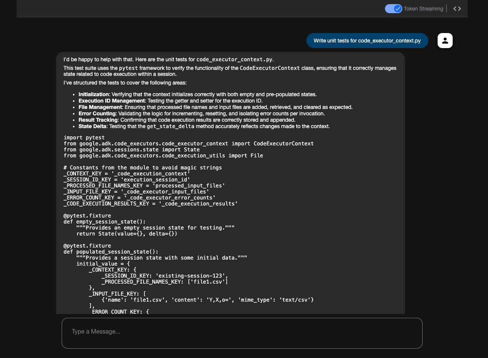
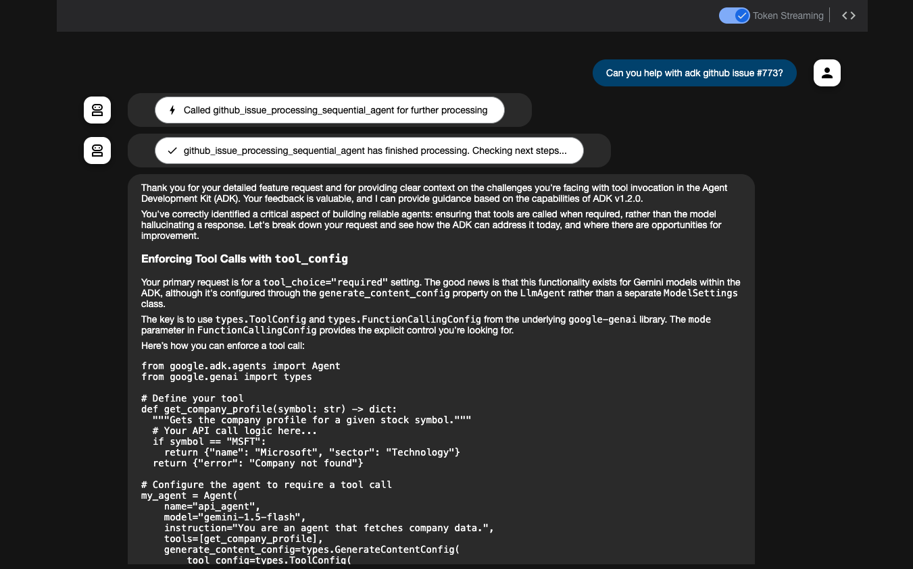
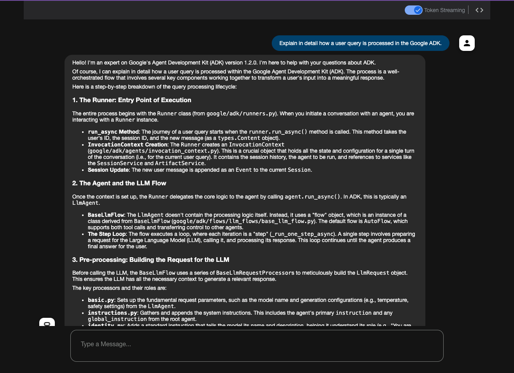
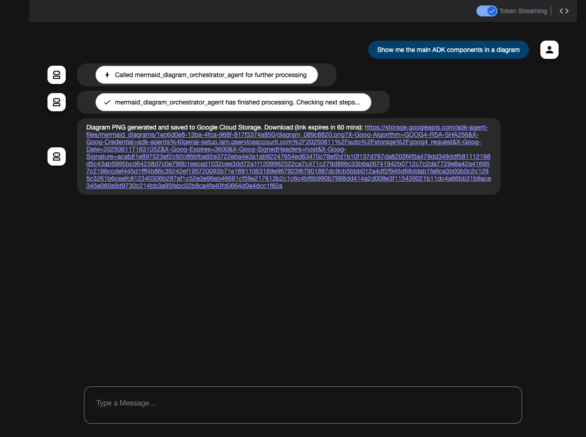
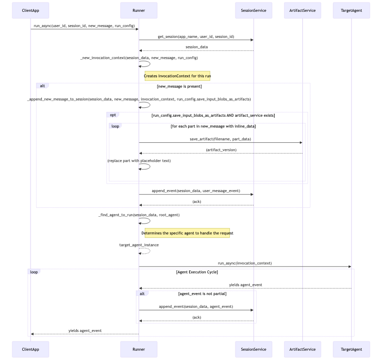
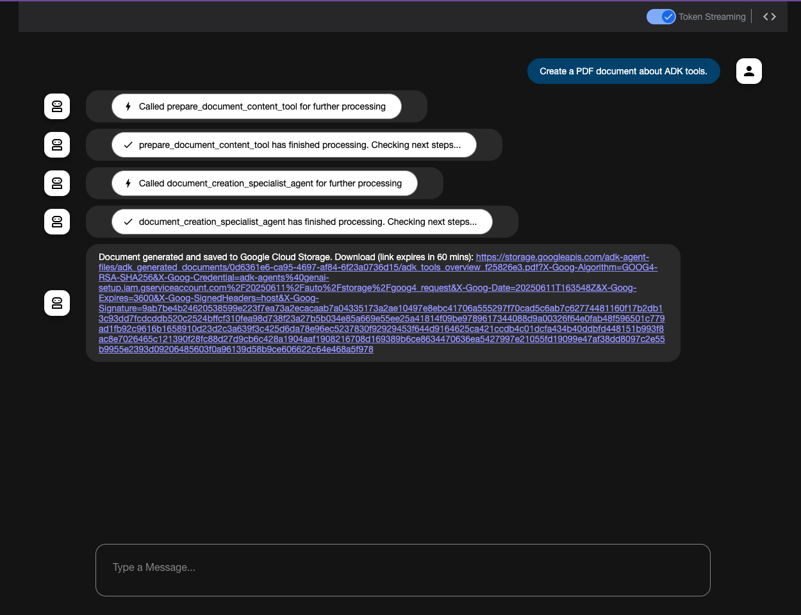

[](https://deepwiki.com/iamulya/adk-expert-agent)
[](https://github.com/astral-sh/ruff)
# ADK Expert Agent with Document and Diagram Generation

This repository contains a sophisticated agent built using Google's Agent Development Kit (ADK) v1.2.0. The agent serves as an expert on ADK, capable of answering questions about ADK, , help you debug and fix errors in your ADK code, even provide you guidance about any of ADK's GitHub issues, generate unit tests for ADK components and Evalsets for your own agents! It is also capable of generating documents (PDF, HTML, PPTX), and creating Mermaid architecture diagrams, related to any of your ADK queries.

## Features

*   **ADK Expertise:** Answers general questions about Google ADK v1.2.0.
*   **Write ADK Agents:** Help you design and even write ADK agents, for e.g. ask "write a multi-agent setup for HR onboarding" 
*   **Debug and Fix errors:** Provide your ADK code including your query and the ADK expert agent will provide you guidance on how to solve the issues.
*   **Generate Unit tests:** Use the ADK knowledge to create tests for the ADK components.
*   **Evalsets for your own ADK Agents:** Provide your code to the expert agent and as long as the total amount of input tokens don't exceed 1 million, the expert agent will be able to create Evalsets for your own agents.
*   **GitHub Issue Processing:**
    *   Fetches details for specific GitHub issues from the `google/adk-python` repository.
    *   Provides ADK-specific guidance based on the issue content.
*   **Document Generation:**
    *   Generates Markdown content based on user queries and ADK knowledge.
    *   Converts Markdown to PDF, HTML (Marp slides), or PPTX (Marp slides).
    *   Uploads generated documents to Google Cloud Storage and provides a signed URL.
*   **Mermaid Diagram Generation:**
    *   Generates Mermaid diagram syntax based on user requests and ADK context.
    *   Converts Mermaid syntax to PNG images.
    *   Uploads generated diagrams to Google Cloud Storage and provides a signed URL.
*   **Modular Architecture:**
    *   A `root_agent` (orchestrator) to delegate tasks to specialized agents.
    *   Dedicated agents for GitHub issue processing, document generation, and diagram orchestration.
    *   A suite of tools for specific functionalities (e.g., GitHub API interaction, Marp CLI, Mermaid CLI).
*   **Web UI:** An Angular-based web interface for interacting with the agent.
*   **Evaluation Sets:** Includes `evalsets` for testing the behavior and responses of different agent components.

## Directory Structure

```
└── adk-expert-agent/
    ├── README.md
    ├── pyproject.toml
    ├── evalsets/
    │   ├── document_generator_agent_evalset.json
    │   ├── github_issue_processing_agent_evalset.json
    │   ├── mermaid_diagram_orchestrator_agent_evalset.json
    │   ├── mermaid_syntax_generator_agent_evalset.json
    │   ├── mermaid_syntax_verifier_agent_evalset.json
    │   └── root_agent_evalset.json
    ├── example-outputs/
    ├── expert-agents/
    │   ├── __init__.py
    │   ├── agent.py  # Contains root_agent (adk_expert_orchestrator)
    │   ├── callbacks.py
    │   ├── config.py
    │   ├── context_loader.py
    │   ├── Dockerfile
    │   ├── puppeteer-config.json
    │   ├── test.md
    │   ├── test.mmd
    │   ├── .env.example
    │   ├── data/
    │   │   └── google-adk-python-1.2.0.txt
    │   ├── agents/  # Specialized agents
    │   │   ├── __init__.py
    │   │   ├── document_generator_agent.py
    │   │   ├── github_issue_processing_agent.py
    │   │   ├── mermaid_diagram_orchestrator_agent.py
    │   │   ├── mermaid_syntax_generator_agent.py
    │   │   └── mermaid_syntax_verifier_agent.py
    │   └── tools/   # Reusable tools
    │       ├── __init__.py
    │       ├── adk_guidance_tool.py
    │       ├── clean_github_issue_text_tool.py
    │       ├── construct_github_url_tool.py
    │       ├── extract_github_issue_details_tool.py
    │       ├── github_issue_tool.py
    │       ├── github_utils.py
    │       ├── handle_extraction_result_tool.py
    │       ├── marp_document_tools.py
    │       ├── marp_utils.py
    │       ├── mermaid_to_png_and_upload_tool.py
    │       └── prepare_document_content_tool.py
    ├── webui/  # Angular frontend
    │   ├── README.md
    │   ├── Dockerfile
    │   ├── nginx.conf
    │   ├── package.json
    │   ├── ... (Angular project files)
```

## Core Components

*   **Root Agent (`adk_expert_orchestrator`):** The main entry point. It analyzes user queries and delegates tasks to specialized agents for document generation, diagram creation, or GitHub issue processing. It can also answer general ADK questions directly.
*   **GitHub Issue Processing Agent (`github_issue_processing_sequential_agent`):**
    1.  Uses `GetGithubIssueDescriptionTool` to fetch the description of a GitHub issue.
    2.  Uses `ADKGuidanceTool` to provide ADK-specific advice based on the issue content and the ADK knowledge base.
*   **Document Generator Agent (`document_creation_specialist_agent`):**
    1.  The root agent first calls `PrepareDocumentContentTool` to generate Markdown content based on the user's request (e.g., "create a PDF about ADK tools").
    2.  This agent then takes the Markdown, desired document type (PDF, HTML, PPTX), and filename.
    3.  It uses internal tools (`generate_pdf_from_markdown_with_gcs`, etc.) leveraging `marp-cli` to convert the Markdown.
    4.  The resulting document is uploaded to Google Cloud Storage, and a signed URL is returned.
*   **Mermaid Diagram Orchestrator Agent (`mermaid_diagram_orchestrator_agent`):**
    1.  Calls the `MermaidSyntaxGeneratorAgent` to produce Mermaid syntax from a user's description (e.g., "draw a sequence diagram for login").
    2.  The generated syntax is then passed to the `MermaidToPngAndUploadTool`.
    3.  This tool uses `mmdc` (Mermaid CLI) to convert the syntax into a PNG image.
    4.  The PNG is uploaded to Google Cloud Storage, and a signed URL is returned.
*   **Mermaid Syntax Generator Agent (`mermaid_syntax_generator_agent`):** An LLM-based agent that takes a natural language description and ADK context to generate Mermaid diagram syntax.
*   **Mermaid Syntax Verifier Agent (`mermaid_syntax_verifier_agent`):** An LLM-based agent designed to verify and correct Mermaid syntax (available but not directly in the main diagram orchestration flow of `mermaid_diagram_orchestrator_agent`).
*   **Tools:** A collection of Python classes and functions that provide specific capabilities to the agents, such as interacting with GitHub, cleaning text, generating documents with Marp, and converting Mermaid diagrams.

## High-Level Architecture



Further information around the architecture and design can be found here: https://deepwiki.com/iamulya/adk-expert-agent

## ADK Expert Agent Demo

https://github.com/user-attachments/assets/8301c269-0ce1-4a28-88c1-939dc2d716dd


## UI / Query Examples

**Home Page**



**Helps you design and write ADK agents**



**Unit-Test Generation**



**Guidance related to a Github issue**



**Detailed ADK Query**



**Architectural Diagram Generation**



Example PNG



**Document Generation**



[Example PDF](example-outputs/adk_tools_overview_example.pdf)

## Technology Stack

*   **Backend:** Python, Google Agent Development Kit (ADK), Google Gemini Models.
*   **Document Generation:** Marp CLI.
*   **Diagram Generation:** Mermaid CLI.
*   **Frontend:** Angular, Angular Material.
*   **Cloud Services:** Google Cloud Secret Manager (for API keys), Google Cloud Storage (for documents and diagrams), Cloud Run for deployment

## Prerequisites

*   Python 3.12 or higher.
*   Node.js and npm (for WebUI development).
*   Docker (for containerized deployment).
*   Google Cloud SDK (`gcloud` CLI) authenticated.
*   `mmdc` (Mermaid CLI) and `marp-cli` installed globally or accessible in PATH if running locally without Docker for the backend. The backend Dockerfile handles these installations.

## Setup

### 1. Clone the Repository

```bash
git clone <repository-url>
cd adk-expert-agent
```

### 2. Backend Setup (`expert-agents`)

1.  **Create and Activate a Python Virtual Environment:**
    ```bash
    python -m venv .venv
    source .venv/bin/activate  # On Windows: .venv\Scripts\activate
    ```

2.  **Install Dependencies:**
    Using `uv` (recommended):
    ```bash
    pip install uv
    uv pip install -e .  # Installs from pyproject.toml in editable mode
    ```
    Or using `pip`:
    ```bash
    pip install -e .
    ```

3.  **Install Playwright Browsers (Conditional):**
    The `ExtractGitHubIssueDetailsTool` (which is not the primary method for GitHub issue fetching in this agent but is available) uses `browser-use`, which relies on Playwright. If you intend to use this specific tool:
    ```bash
    playwright install --with-deps chromium
    ```

4.  **Configure Environment Variables:**
    *   Copy `expert-agents/.env.example` to `expert-agents/.env`.
    *   Fill in the required values:
        *   `GCP_PROJECT_ID`: Your Google Cloud Project ID where secrets for GEMINI_API and GITHUB_API_PAT are saved (see below).
        *   `GCP_PROJECT_NUMBER`: Your Google Cloud Project Number (numeric, used for Secret Manager paths). You can get this from the GCP console or via `gcloud projects describe YOUR_PROJECT_ID --format='value(projectNumber)'`.
        *   `GEMINI_API_KEY_SECRET_ID`: Secret ID in Google Cloud Secret Manager for your Gemini API Key.
        *   `GITHUB_API_PAT_SECRET_ID`: Secret ID for your GitHub Personal Access Token (PAT) with read access to public repositories.
        *   `GCS_BUCKET_NAME_FOR_DOCS`: Name of the GCS bucket for storing generated documents and diagrams.
        *   `GCS_PROJECT_ID_FOR_DOCS_BUCKET`: Project ID where the GCS bucket resides.
        *   `GCS_SIGNED_URL_SA_EMAIL`: Service Account email to impersonate for generating GCS signed URLs (e.g., `your-sa@your-gcp-project.iam.gserviceaccount.com`). This SA needs "Service Account Token Creator" role on itself and "Storage Object Viewer/Admin" on the bucket.
        *   `SIGNED_URL_EXPIRATION_SECONDS` (Optional, defaults to 3600): Expiration time for GCS signed URLs.
        *   `MERMAID_CLI_PATH` (Optional, defaults to `mmdc`): Path to Mermaid CLI executable if not in system PATH.
        *   `PUPPETEER_CONFIG_PATH` (Optional, defaults to `/app/puppeteer-config.json` inside Docker): Path to Puppeteer config for Mermaid CLI.

    *   Ensure the service account or user running the agent has IAM permissions to access these secrets in Secret Manager and to interact with GCS (create objects, generate signed URLs via impersonation).

5.  **Google Cloud Authentication:**
    Ensure your local environment is authenticated with Google Cloud:
    ```bash
    gcloud auth application-default login
    ```

### 3. Frontend Setup (`webui`) (for development)

1.  Navigate to the `webui` directory:
    ```bash
    cd webui
    ```
2.  Install Node.js dependencies:
    ```bash
    npm install
    ```

## Running the Application

### A. Locally

1.  **Run the Backend (`expert-agents`):**
    From the `adk-expert-agent/expert-agents` directory (ensure your virtual environment is active and `.env` is configured):
    ```bash
    adk api_server --host 0.0.0.0 --port 8000 --allow_origins "http://localhost:4200" .
    ```
    This starts the ADK API server, serving the `expert-agents` application. The `.` indicates the current directory is the ADK app root.

2.  **Run the Frontend (`webui`):**
    From the `adk-expert-agent/webui` directory, in a new terminal:
    ```bash
    npm run serve --backend=http://localhost:8000
    ```
    This will compile the Angular application and serve it, typically on `http://localhost:4200`. The UI will connect to the backend specified by the `--backend` flag.

    Access the Web UI at `http://localhost:4200`.

## Important Notes

* Gemini 3 Pro Preview is being used as the model, so it can take good amount of time depending on the complexity of the queries, especially the ones that generate architectural diagrams, slides, pdf etc.

* The Github issue guidance feature provides great output. I have already used it with real ADK issues where the agent output was really appreciated.

* During Content generation (diagrams, pdf, pptx), the behavior can sometime be a bit random. I have seen in my tests that the exact same query can result a great output and other times in an error. Hence, keep in mind that the model can return erroneous mermaid output (primarily syntax errors) which may not be convertable into output files. In such cases, the markdown or the mermaid output from the model is provided as the agent response so that the user has the opportunity to correct any small issues that might exist.

* Especially during PDF and PPTX generation, the model can sometime randomly throw out a 500, even with queries that worked all the time in the past. I have tested it with the latest Gemini models and the 3 Pro Preview gives the best results, however it can also throw 500 for the same query that it worked with in the last few times.

* Sometimes when running a query, ever since the new Gemini 3 Pro Preview (gemini-3-pro-preview, the one recommended to be used to be future proof) is in use, the LLM responds non-stop with `ctrl46` which results in an abnormal behavior on the UI.  A refresh (to start a new session) and retrying the query after a bit of time usually helps to overcome the issue.

* If an error occurs, it is almost always from LLM side. Retrying the same query (eventually after waiting a bit) solves the issue most of the time
